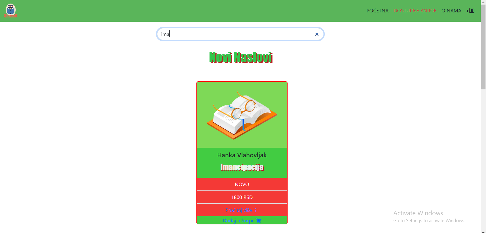
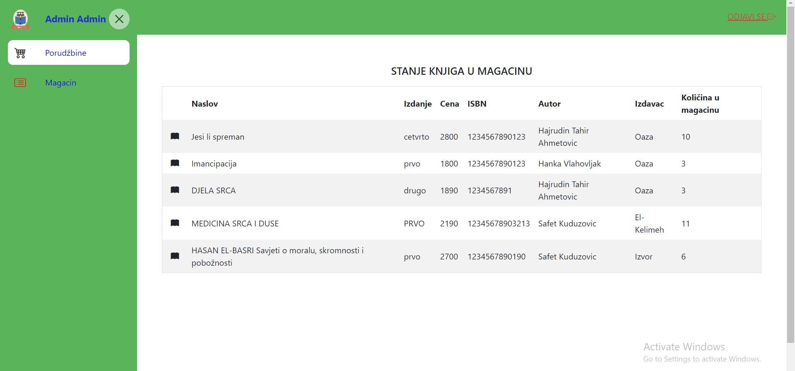

# EBookStore AngularApp

Using Angular and ASP.NET technology , the database is a web application for online bookstore.

<a href="https://github.com/minelaganovic/E_BookStore_B">You can find the link to the backend code at the following URL: Backend </a>

There are at least two types of registered users: administrator and users. The system can also be accessed by unregistered users, but only the web pages for search book and home page.

To order a book, login/registration in the system is required.

 

 

## This project was generated with [Angular CLI](https://github.com/angular/angular-cli) version 16.1.0.

## Development server

Run `ng serve` for a dev server. Navigate to `http://localhost:4200/`. The application will automatically reload if you change any of the source files.

## Code scaffolding

Run `ng generate component component-name` to generate a new component. You can also use `ng generate directive|pipe|service|class|guard|interface|enum|module`.

## Build

Run `ng build` to build the project. The build artifacts will be stored in the `dist/` directory.

## Running unit tests

Run `ng test` to execute the unit tests via [Karma](https://karma-runner.github.io).

## Running end-to-end tests

Run `ng e2e` to execute the end-to-end tests via a platform of your choice. To use this command, you need to first add a package that implements end-to-end testing capabilities.

## Further help

To get more help on the Angular CLI use `ng help` or go check out the [Angular CLI Overview and Command Reference](https://angular.io/cli) page.
